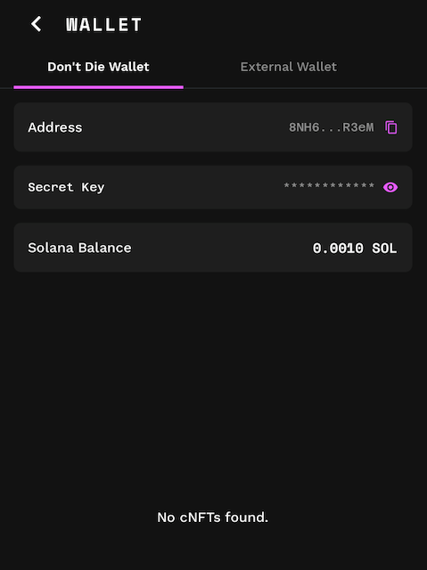

# Wallet

## What is the wallet?

The wallet is a [Solana](https://solana.com/) wallet. It has an address, secret key and a balance.

## Address

The address is exactly as it sounds, it's your wallet's address! Same as your house address it uniquely identifies your wallet and is a publicly available piece of information. If someone ever wants to send you any SOL (the currency of Solana) they can send it your address.

## Secret Key

:::danger

NEVER. EVER. NEVER. EVER. Tell anybody your secret key. Your entire wallet will be compromised and you will just have to let it go. Don't be an idiot. NEVER EVER GIVE ANYBODY YOUR SECRET

:::

With that warning out of the way... Your secret key is basically the password to the wallet. You can use this in apps like [Phantom](https://phantom.com/) to open and interact with the wallet in more advanced ways than just in the Don't Die App.

## Balance

How much money you have! The balance is how much SOL you have in your wallet.
