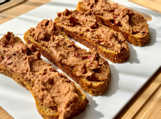

# Snacks

## Vegan Kidney Bean Pâté (@SAVI444)

This vegan kidney bean pâté is rich, creamy and full of plant-based goodness! A delicious alternative to traditional pâté, it's perfect for spreading on crackers, toast or adding to any meal.

- Kidney beans
- Garlic
- Lemon
- Warming spice such as cumin
- Extra creaminess add tahini or olive oil
